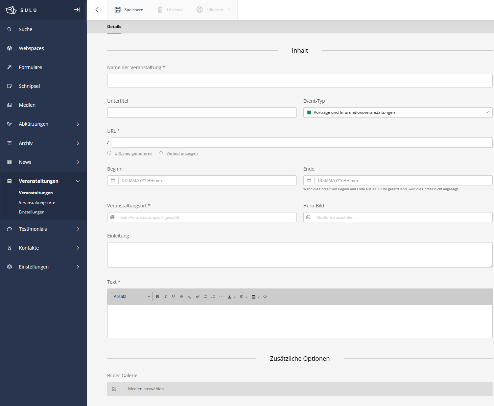

# SuluEventBundle!


[](https://github.com/manuxi/SuluEventBundle/blob/2.x/LICENSE)


[🇬🇧 English Version](README.md)

Das SuluEventBundle erweitert die Sulu CMF um eine umfassende Veranstaltungsverwaltung. 
Es ermöglicht die Erstellung und Verwaltung von Events mit detaillierten Informationen, Orten, Medien und mehrsprachiger Unterstützung. 
Erweiterte Funktionen wie wiederkehrende Termine, ein Kalender-Frontend, iCal-Export und Social-Media-Integration sind ebenfalls enthalten.
Dieses Bundle basiert auf dem [Sulu Workshop](https://github.com/sulu/sulu-workshop) und wurde im Laufe der Zeit mit immer mehr Features ausgestattet.



## ✨ Features

### 📅 Event-Verwaltung
- **Umfangreiche Event-Details** - Titel, Untertitel, Zusammenfassung, Text und weiteres
- **Datum & Uhrzeit** - Flexible Start-/Enddaten
- **Veranstaltungsorte** - Separate Ortsverwaltung mit Adressdetails
- **Medien-Integration** - Hero-Bilder, Bildergalerien, PDF-Anhänge
- **SEO & Excerpt** - Vollständige SEO- und Excerpt-Verwaltung
- **Mehrsprachig** - Vollständige Übersetzungsunterstützung
- **Autoren-Verwaltung** - Kontakte können als Event-Autoren zugewiesen werden
- **Einstellungen** - Umfangreiche Einstellungsmöglichkeiten
- **Weiteres** - Papierkorb, Automationen, usw.
- 
### 🔄 Erweiterte Features
- **Wiederkehrende Events** - Tägliche, wöchentliche, monatliche, jährliche Muster mit Ausnahmen
- **Social-Media-Integration** - Pro-Event-Sharing-Konfiguration (Facebook, Twitter, LinkedIn, Instagram, WhatsApp)
- **Kalender** - FullCalendar.js Integration mit Jahres-/Monats-/Wochen-/Listenansicht
- **iCal-Export** - Einzelne Events oder vollständige Kalender-Abonnements (webcal://)
- **RSS/Atom-Feeds** - Abonnenten über neue Events auf dem Laufenden halten
- **Smart Content** - Als Content-Block in jeder Sulu-Seite verwendbar

## 📋 Voraussetzungen

- PHP 8.2 oder höher
- Sulu CMS 2.6 oder höher
- Symfony 6.2 oder höher
- MySQL 5.7+ / MariaDB 10.2+ / PostgreSQL 11+

## 👩🏻‍🏭 Installation

### Schritt 1: Paket installieren

```bash
composer require manuxi/sulu-event-bundle
```

Falls du *nicht* Symfony Flex verwendest, füge das Bundle in `config/bundles.php` hinzu:

```php
return [
    //...
    Manuxi\SuluEventBundle\SuluEventBundle::class => ['all' => true],
];
```

### Schritt 2: Routen konfigurieren

Zu `routes_admin.yaml` hinzufügen:

```yaml
SuluEventBundle:
    resource: '@SuluEventBundle/Resources/config/routes_admin.yaml'
```
Für FullCalendar-Integration/iCal/Feeds muss Folgendes zu `routes_website.yaml` hinzugefügt werden:

```yaml
SuluEventBundle:
    resource: '@SuluEventBundle/Resources/config/routes_website.yaml'
```

### Schritt 3: Suche konfigurieren

Füge zu `sulu_search.yaml` hinzu:

```yaml
sulu_search:
    website:
        indexes:
            - events_published  # Veröffentlichte Events (Website)
            - events            # Entwürfe Events (Admin)
```

### Schritt 4: Datenbank aktualisieren

```bash
# Prüfe was erstellt wird
php bin/console doctrine:schema:update --dump-sql

# Führe Migration aus
php bin/console doctrine:schema:update --force
```

### Schritt 5: Berechtigungen erteilen

1. Gehe zu Sulu Admin → Einstellungen → Benutzerrollen
2. Finde die passende Rolle
3. Aktiviere Berechtigungen für "Events" und "Locations"
4. Lade die Seite neu

## 🎣 Verwendung

### Erstes Event erstellen

1. Navigiere zu **Events** in der Sulu-Admin-Navigation
2. Klicke auf **Event hinzufügen**
3. Erstelle zuerst mindestens einen **Veranstaltungsort**
4. Erstelle dann dein Event mit allen Details
5. Konfiguriere Social-Media-Einstellungen (optional)
6. Richte Wiederholungsmuster ein (optional)
7. Veröffentliche dein Event

## 🧶 Konfiguration

Die Konfiguration findest Du hier: [Einstellungen](docs/settings.de.md)

## 📖 Dokumentation

Detaillierte Dokumentation im [docs/](docs/) Verzeichnis.

- [Kalender-Integration](docs/calendar.de.md) - FullCalendar.js-Integration
- [Social Media](docs/social-media.de.md) - Social-Sharing-Konfiguration
- [Wiederkehrende Events](docs/recurrence.de.md) - Wiederholende Event-Muster
- [Feeds/iCal](docs/feeds-ical.de.md) - Feeds und iCal Handling
- [Standorte](docs/locations.de.md) - Standorte, die Events zugeordnet werden
- [Eigene Event-Types](docs/event-types.de.md) - Event-Types können selber konfiguriert werden
- [Listenansicht](docs/list-view.de.md) - Listen-Ansicht-Tweaks
- [List-Transformer](docs/list-transformer.de.md) - Typ-Transformer für Listen
- [Settings](docs/settings.de.md) - Einstellungen

## 👩‍🍳 Mitwirken

Beiträge sind willkommen! Bitte erstelle Issues oder Pull Requests.

## 📝 Lizenz

Dieses Bundle ist unter der MIT-Lizenz lizenziert. Siehe [LICENSE](LICENSE).

## 🎉 Credits

Erstellt und gewartet von [manuxi](https://github.com/manuxi).

Danke an das Sulu-Team für das tolle CMS und den fantastischen Support!

Danke an FullCalendar für den Kalender!

Und danke an *Dich* für Deine Mithilfe, Tests und Bugsuche!
