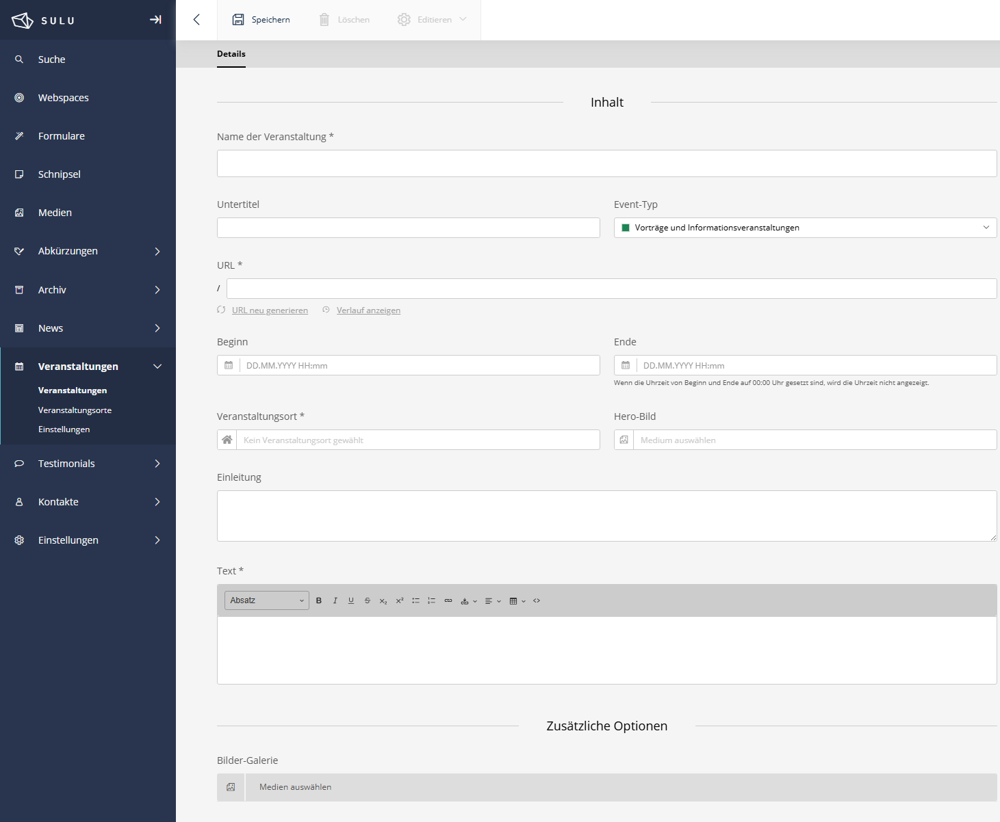

# SuluEventBundle!

[](https://github.com/manuxi/SuluEventBundle/LICENSE)


[🇩🇪 German Version](README.de.md)

This bundle is based on the [Sulu Workshop](https://github.com/sulu/sulu-workshop) and has been equipped with more and more features over time.



## ✨ Features

### 📅 Event Management
- **Complete Event Lifecycle** - Create, publish, and archive events
- **Extensive Event Details** - Title, subtitle, summary, text, footer
- **Date & Time** - Flexible start/end dates with timezone support
- **Locations** - Separate location management with address details
- **Media Integration** - Hero images, image galleries, PDF attachments
- **SEO & Excerpt** - Full SEO and excerpt management
- **Multilingual** - Full translation support
- **Author Management** - Assign contacts as event authors
- **Settings** - Extensive configuration options
- **More** - Trash, automations, etc.

### 🔄 Advanced Features
- **Recurring Events** - Daily, weekly, monthly, yearly patterns with exceptions
- **Social Media Integration** - Per-event sharing configuration (Facebook, Twitter, LinkedIn, Instagram, WhatsApp)
- **Calendar** - FullCalendar.js integration with month/week/list view
- **iCal Export** - Single events or full calendar subscriptions (webcal://)
- **RSS/Atom Feeds** - Keep subscribers updated on new events
- **Smart Content** - Usable as a content block in any Sulu page

## 📋 Prerequisites

- PHP 8.1 or higher
- Sulu CMS 2.6 or higher
- Symfony 6.2 or higher
- MySQL 5.7+ / MariaDB 10.2+ / PostgreSQL 11+

## 👩🏻‍🏭 Installation

### Step 1: Install the package

```bash
composer require manuxi/sulu-event-bundle
```

If you are *not* using Symfony Flex, add the bundle to `config/bundles.php`:

```php
return [
    //...
    Manuxi\SuluEventBundle\SuluEventBundle::class => ['all' => true],
];
```

### Step 2: Configure routes

Add to `routes_admin.yaml`:

```yaml
SuluEventBundle:
    resource: '@SuluEventBundle/Resources/config/routes_admin.yaml'
```
For FullCalendar integration/iCal/Feeds, the following must be added to `routes_website.yaml`:

```yaml
SuluEventBundle:
    resource: '@SuluEventBundle/Resources/config/routes_website.yaml'
```

### Step 3: Configure search

Add to `sulu_search.yaml`:

```yaml
sulu_search:
    website:
        indexes:
            - events_published  # Published Events (Website)
            - events            # Draft Events (Admin)
```

### Step 4: Update the database

```bash
# Check what will be created
php bin/console doctrine:schema:update --dump-sql

# Execute migration
php bin/console doctrine:schema:update --force
```

### Step 5: Grant permissions

1. Go to Sulu Admin → Settings → User Roles
2. Find the appropriate role
3. Enable permissions for "Events" and "Locations"
4. Reload the page

## 🎣 Usage

### Create your first event

1. Navigate to **Events** in the Sulu admin navigation
2. Click on **Add event**
3. First, create at least one **Location**
4. Then create your event with all the details
5. Configure social media settings (optional)
6. Set up recurrence patterns (optional)
7. Publish your event

## 🧶 Configuration

You can find the extensive configuration here: [Settings](docs/settings.en.md)

## 📖 Documentation

Detailed documentation in the [docs/](docs/) directory.

- [Calendar Integration](docs/calendar.en.md) - FullCalendar.js integration
- [Social Media](docs/social-media.en.md) - Social sharing configuration
- [Recurring Events](docs/recurrence.en.md) - Recurring event patterns
- [Feeds/iCal](docs/feeds-ical.en.md) - Feeds and iCal handling
- [Locations](docs/locations.en.md) - Locations that are assigned to events
- [Custom Event Types](docs/event-types.en.md) - Event types can be set by yourself
- [List Transformer](docs/list-transformer.en.md) - Type transformer for lists
- [Settings](docs/settings.en.md) - Settings

## 👩‍🍳 Contributing

Contributions are welcome! Please create issues or pull requests.

## 📝 License

This bundle is licensed under the MIT License. See [LICENSE](LICENSE).

## 🎉 Credits

Created and maintained by [manuxi](https://github.com/manuxi).

Thanks to the Sulu team for the great CMS and fantastic support!

Thanks to FullCalendar for the calendar.

And thank *you* for your support and testing!