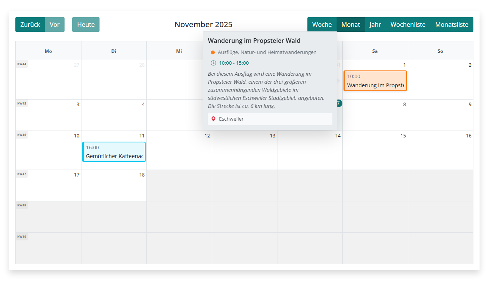
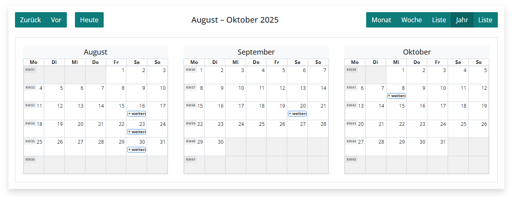
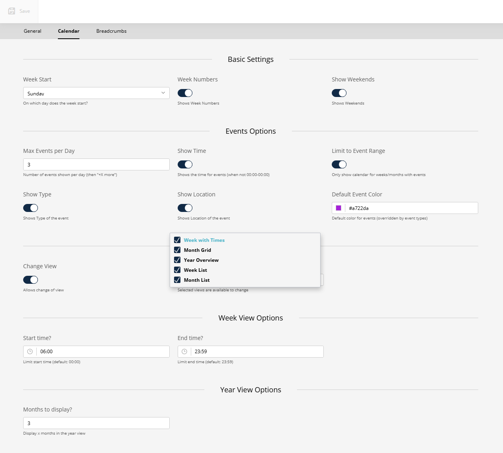

# Calendar Feature

## Overview

The SuluEventBundle includes an integrated calendar system powered by FullCalendar. This feature allows you to display events in various calendar views on your website.




## Installation

The installation is not entirely straightforward. There are certainly other ways (which I would love to hear about!), but I will describe mine.

[Bootstrap-Icons](https://icons.getbootstrap.com/) are used for the calendar overlays.

Load the sources in the main project:

```bash
npm install --save @fullcalendar/core@^6.1.19 @fullcalendar/bootstrap5@^6.1.19 @fullcalendar/daygrid@^6.1.19 @fullcalendar/timegrid@^6.1.19 @fullcalendar/list@^6.1.19 @fullcalendar/multimonth@^6.1.19 bootstrap-icons@^1.13.1 core-js@3 
```
or
```bash
yarn add @fullcalendar/core@^6.1.19 @fullcalendar/bootstrap5@^6.1.19 @fullcalendar/daygrid@^6.1.19 @fullcalendar/timegrid@^6.1.19 @fullcalendar/list@^6.1.19 @fullcalendar/multimonth@^6.1.19 bootstrap-icons@^1.13.1 core-js@3
```

Javascript:
assets/website/js/app.js:
```javascript
import '../../../vendor/manuxi/sulu-event-bundle/src/Resources/public/js/calendar.js';
```
Insert Bootstrap-Icons:
```javascript
import 'bootstrap-icons/font/bootstrap-icons.css';
```

(Optional) scss:
assets/website/scss/app.scss:
```scss
@import '../../../vendor/manuxi/sulu-event-bundle/src/Resources/public/scss/calendar.scss';
```

To ensure that the project variables are also available in scss (webpack.config.js):
```javascript
Encore.enableSassLoader(options => {
    options.sassOptions = {
        includePaths: [
            'assets/website/scss',
        ],
    };
    options.additionalData = `
        @import "config/variables"; 
        @import "config/variables.components";
    `;
})
```
For JavaScripts, I made the following changes in webpack.config.js:
```javascript
// enables and configure @babel/preset-env polyfills
Encore.configureBabelPresetEnv((config) => {
    config.useBuiltIns = 'usage';
    config.corejs = {
        version: 3,
        proposals: true
    };
})
```
and
```javascript
const config = Encore.getWebpackConfig();

// Fix module resolution for core-js and node_modules in bundles
config.resolve = config.resolve || {};
config.resolve.modules = config.resolve.modules || [];
config.resolve.modules.unshift(path.resolve(__dirname, 'node_modules'));
config.resolve.symlinks = true;

module.exports = config;
```

## Configuration

Calendar settings can be configured in the Sulu admin panel under **Settings > Events**.

### Available Settings



#### Calendar Display
- **Week Start**: First day of the week (0 = Sunday, 1 = Monday, etc.)
- **Show Event Time**: Display start/end times in calendar view
- **Show Week Numbers**: Display week numbers in calendar view
- **Show Weekends**: Include Saturday and Sunday in calendar view

#### Events
- **Event Limit Per Day**: Maximum events shown per day before "show more" link appears
- **Limit to Event Range**: Only show dates within the range of scheduled events (currently no function)
- **Show Event Location**: Display location information in calendar view
- **Default Event Color**: Default color for events in calendar view
- 
#### Display Options
- **Toggle Calendar View**: Enable/disable the calendar view entirely
- **Allowed Calendar Views**: Select which views are available (month, week, day, list)

## Usage

### Content Type

Add the calendar to any page using the content type:

```xml
<property name="toggle_calendar" type="checkbox" colspan="2">
    <meta>
        <title lang="en">Show Calendar</title>
        <title lang="de">Kalender zeigen</title>
    </meta>
    <params>
        <param name="type" value="toggler"/>
    </params>
</property>
```

### Template Integration

An element with the class="event-calendar" is expected. Multiple calendars on one page are possible. Specify parameters as follows:

```html

    
        
    

    <div class="col-12 event-calendar justify-content-{{ alignment_content }}"
         data-events-url="{{ path('sulu_event.api.calendar', {
             '_locale': app.request.locale,
             'dataId': events.dataId|default(0),
             'includeSubFolders': events.includeSubFolders|default(0),
             'categories': events.categories|default([]),
             'tags': events.tags|default([])
         }) }}"

         data-initial-view="{{ calendarView|default('dayGridMonth') }}"
         data-locale="{{ app.request.locale }}"
         data-week-numbers="{{ eventsSettings.showWeekNumbers ? 'true' : 'false' }}"
         data-weekends="{{ eventsSettings.showWeekends ? 'true' : 'false' }}"
         data-event-limit="{{ eventsSettings.eventLimitPerDay|default(3) }}"
         data-limit-to-events="{{ eventsSettings.limitToEventRange ? 'true' : 'false' }}"
         data-first-day="{{ eventsSettings.calendarStartDay|default(1) }}"
         data-event-color="{{ eventsSettings.eventColor|default('#ccc') }}"
         data-toggle-view="{{ eventsSettings.toggleCalendarView ? 'true' : 'false' }}"
         data-toggle-location="{{ eventsSettings.showCalendarEventLocation ? 'true' : 'false' }}"
         data-toggle-type="{{ eventsSettings.showCalendarEventType ? 'true' : 'false' }}"
         data-allowed-views="{{ eventsSettings.allowedCalendarViews|join(',') }}">

    </div>

```

'calendarView' controls the initial view. See next section.

### Example of a View-Selector

```html
<property name="allowedCalendarViews" type="select" colspan="4" visibleCondition="__parent.toggleCalendarView">
    <meta>
        <title>sulu_event.config.properties.allowed_calendar_views</title>
        <info_text>sulu_event.config.properties.allowed_calendar_views_info</info_text>
    </meta>
    <params>
        <param name="default_values" type="collection">
            <param name="dayGridMonth"/>
        </param>

        <param name="values" type="collection">
            <param name="timeGridWeek">
                <meta>
                    <title lang="en">Week with Times</title>
                    <title lang="de">Woche (mit Uhrzeiten)</title>
                </meta>
            </param>
            <param name="dayGridMonth">
                <meta>
                    <title lang="en">Month Grid</title>
                    <title lang="de">Monat (Raster)</title>
                </meta>
            </param>
            <param name="multiMonthYear">
                <meta>
                    <title lang="en">Year Overview</title>
                    <title lang="de">Jahresübersicht</title>
                </meta>
            </param>
            <param name="listWeek">
                <meta>
                    <title lang="en">Week List</title>
                    <title lang="de">Wochenliste</title>
                </meta>
            </param>
            <param name="listMonth">
                <meta>
                    <title lang="en">Month List</title>
                    <title lang="de">Monatsliste</title>
                </meta>
            </param>
        </param>
    </params>
</property>
```

## Rate Limiting

The calendar API is rate-limited to 100 requests per hour per IP address. Configure the rate limiter in your Symfony configuration if needed.

## Frontend Implementation

The bundle provides a basic calendar implementation. For advanced customization, refer to the FullCalendar documentation at https://fullcalendar.io/

## All-Day Events

Events are detected as all-day when:
- Start time is 00:00
- End time is 00:00 or no end time is set

All-day events are displayed without time information in the calendar.