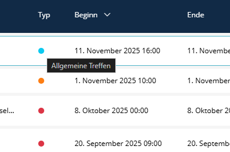
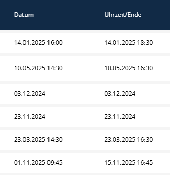
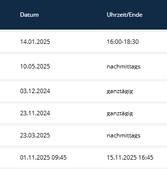
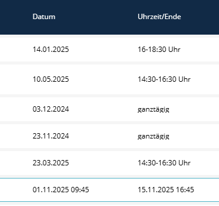

# Listen-Ansicht

In der Liste, die man über Events erreicht, gibt es einige Optionen.

### 1. List-Transformer



Konfiguration hier: [List-Transformer](docs/list-transformer.de.md) - Typ-Transformer für Listen

### 2. Überschreiben der Werte für startDate und endDate

Die üblichen Werte für startDate und endDate sind folgende:

```xml
<property name="startDate" visibility="no" translation="sulu_event.start_date" type="datetime">
    <field-name>startDate</field-name>
    <entity-name>%sulu.model.event.class%</entity-name>
</property>

<property name="endDate" visibility="no" translation="sulu_event.end_date" type="datetime">
    <field-name>endDate</field-name>
    <entity-name>%sulu.model.event.class%</entity-name>
</property>
```

**WICHTIG:** Diese sind in der Standardkonfiguration (events.xml) dieses Bundles überschrieben, um flexibler zu sein.
Falls obige Werte erforderlich sind, kann bspw. die im Bundle enthaltene Resouces/config/lists/events.xml nach config/lists/events.xml kopiert und entsprechend angepasst werden.

Im SuluEventBundle ist die xml angepasst, damit die Datumswerte angepasst werden können:
Dabei sind die ersten beiden Properties nötig, damit startDate/endDate korrekt verarbeitet werden können.

### Konfiguration

Die Konfiguration kann wie folgt angepasst werden:

```yaml
# config/packages/sulu_event.yaml
sulu_event:
    list_date_format: 'time_labels'  # 'time_labels', 'clock_format', 'default'
```

Optionen für list_date_format:
- default: Datum, falls Uhrzeit 00:00, wird sie nicht angezeigt



- time_labels: Labels wie vormittags, nachmittags



- clock_format: im ersten Feld wird das Datum, im zweiten Feld die Uhrzeit(en) angezeigt



### Datumsformatierung

Das Format der Datumsinfos werden per Locale-String gehandhabt.
Standard:

````yaml
sulu_event:
    # Formats
    date_format: 'd.m.Y'
    datetime_format: 'd.m.Y H:i'
````