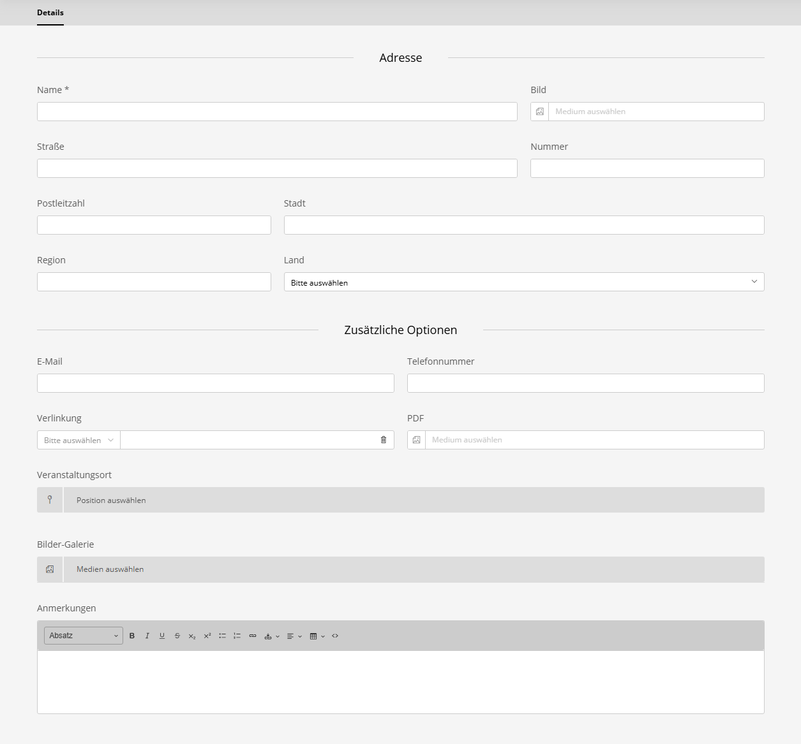

# Standorte

## Übersicht

Das Standortsystem ermöglicht die Verwaltung und Wiederverwendung von Event-Standorten. Standorte werden separat von Events verwaltet und können mehreren Events zugewiesen werden.

## Standorte verwalten

Standorte werden im Sulu-Admin-Panel unter **Events > Standorte** verwaltet.

### Standort-Eigenschaften



- **Name**: Anzeigename des Standorts
- **Straße**: Straßenadresse
- **Nummer**: Haus-/Gebäudenummer
- **Postleitzahl**: PLZ
- **Stadt**: Stadtname
- **Land**: Ländername
- **Notizen**: Zusätzliche Informationen oder Anweisungen
- **Weitere Optionen**

## Standorte Events zuweisen

Bei der Erstellung oder Bearbeitung eines Events können Sie im Feld **Standort** einen Standort aus bestehenden Einträgen auswählen. Dies ist ein Einzelauswahlfeld, das auf vorhandene Standort-Einträge verweist.

## Verwendung in Templates

### Standort-Informationen anzeigen

```html

    <div class="event-location">
        <h3>Standort</h3>
        
        <address>
            <strong>{{ event.location.name }}</strong><br>
            {{ event.location.street }} {{ event.location.number }}<br>
            {{ event.location.postalCode }} {{ event.location.city }}<br>
            {{ event.location.country }}
        </address>
        
        
            <p class="location-notes">{{ event.location.notes }}</p>
        
    </div>

```

### Karte anzeigen

Wenn Breiten- und Längengrad gesetzt sind:

```html

    <div class="location-map">
        <div id="map" 
             data-lat="{{ event.location.latitude }}" 
             data-lng="{{ event.location.longitude }}"
             data-name="{{ event.location.name }}">
        </div>
    </div>

```

### Formatierte Adresse erhalten

```html


<p>{{ address }}</p>
```

### Karten-Links generieren

#### Google Maps
```html

    
    
    <a href="https://www.google.com/maps/search/?api=1&query={{ query }}" 
       target="_blank">
        In Google Maps öffnen
    </a>

```

#### OpenStreetMap
```html

    <a href="https://www.openstreetmap.org/?mlat={{ event.location.latitude }}&mlon={{ event.location.longitude }}&zoom=15" 
       target="_blank">
        In OpenStreetMap öffnen
    </a>

```

### Verwendung im Template

```html

    <a href="mailto:{{ location.email }}">{{ location.email }}</a>



    <a href="tel:{{ location.phoneNumber }}">{{ location.phoneNumber }}</a>



    <a href="{{ location.link.href }}" 
       target="{{ location.link.target }}">
        {{ location.link.title ?: 'Website' }}
    </a>



    <a href="{{ location.pdf.url }}" target="_blank">
        Download PDF
    </a>



    {# Map integration #}
    <div data-lat="{{ location.latitude }}" 
         data-lng="{{ location.longitude }}">
    </div>



    <div class="location-gallery">
        
            
        
    </div>

```

### Beispiel: JavaScript-Geocoding

```javascript
async function geocodeLocation(address) {
    const url = `https://nominatim.openstreetmap.org/search?format=json&q=${encodeURIComponent(address)}`;
    const response = await fetch(url);
    const data = await response.json();
    
    if (data.length > 0) {
        return {
            latitude: parseFloat(data[0].lat),
            longitude: parseFloat(data[0].lon)
        };
    }
    
    return null;
}
```

## Schema.org-Integration

Für korrektes Event-Markup Standortdaten einbeziehen:

```javascript
<script type="application/ld+json">
{
    "@context": "https://schema.org",
    "@type": "Event",
    "name": "{{ event.title }}",
    "startDate": "{{ event.startDate|date('c') }}",
    
    "location": {
        "@type": "Place",
        "name": "{{ event.location.name }}",
        "address": {
            "@type": "PostalAddress",
            "streetAddress": "{{ event.location.street }} {{ event.location.number }}",
            "addressLocality": "{{ event.location.city }}",
            "postalCode": "{{ event.location.postalCode }}",
            "addressCountry": "{{ event.location.country }}"
        }
        ,
        "geo": {
            "@type": "GeoCoordinates",
            "latitude": {{ event.location.latitude }},
            "longitude": {{ event.location.longitude }}
        }
        
    }
    
}
</script>
```
