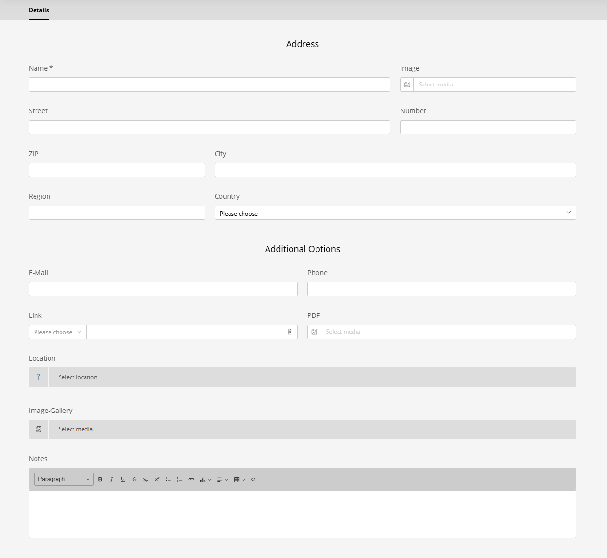

# Locations

## Overview

The location system allows you to manage and reuse event locations. Locations are managed separately from events and can be assigned to multiple events.

## Managing Locations

Locations are managed in the Sulu admin panel under **Events > Locations**.

### Location Properties



- **Name**: Display name of the location
- **Street**: Street address
- **Number**: House/building number
- **Postal Code**: ZIP/postal code
- **City**: City name
- **Country**: Country name
- **Latitude**: Geographic latitude (for maps)
- **Longitude**: Geographic longitude (for maps)
- **Notes**: Additional information or instructions

## Assigning Locations to Events

When creating or editing an event, you can select a location from the **Location** field. This is a single-selection field that references existing location entries.

## Usage in Templates

### Display Location Information

```html

    <div class="event-location">
        <h3>Location</h3>
        
        <address>
            <strong>{{ event.location.name }}</strong><br>
            {{ event.location.street }} {{ event.location.number }}<br>
            {{ event.location.postalCode }} {{ event.location.city }}<br>
            {{ event.location.country }}
        </address>
        
        
            <p class="location-notes">{{ event.location.notes }}</p>
        
    </div>

```

### Display Map

If latitude and longitude are set:

```html

    <div class="location-map">
        <div id="map" 
             data-lat="{{ event.location.latitude }}" 
             data-lng="{{ event.location.longitude }}"
             data-name="{{ event.location.name }}">
        </div>
    </div>

```

### Get Formatted Address

```html


<p>{{ address }}</p>
```

### Generate Map Links

#### Google Maps
```html

    
    
    <a href="https://www.google.com/maps/search/?api=1&query={{ query }}" 
       target="_blank">
        Open in Google Maps
    </a>

```

#### OpenStreetMap
```html

    <a href="https://www.openstreetmap.org/?mlat={{ event.location.latitude }}&mlon={{ event.location.longitude }}&zoom=15" 
       target="_blank">
        Open in OpenStreetMap
    </a>

```

### Template usage

```html

    <a href="mailto:{{ location.email }}">{{ location.email }}</a>



    <a href="tel:{{ location.phoneNumber }}">{{ location.phoneNumber }}</a>



    <a href="{{ location.link.href }}" 
       target="{{ location.link.target }}">
        {{ location.link.title ?: 'Website' }}
    </a>



    <a href="{{ location.pdf.url }}" target="_blank">
        Download PDF
    </a>



    {# Map integration #}
    <div data-lat="{{ location.latitude }}" 
         data-lng="{{ location.longitude }}">
    </div>



    <div class="location-gallery">
        
            
        
    </div>

```

## Geocoding

The bundle does not include automatic geocoding. You can:

1. **Manual entry**: Enter latitude/longitude manually
2. **External service**: Use a geocoding service (Google Maps, OpenStreetMap Nominatim)
3. **Custom implementation**: Add geocoding via event listeners or custom commands

### Example: JavaScript Geocoding

```javascript
async function geocodeLocation(address) {
    const url = `https://nominatim.openstreetmap.org/search?format=json&q=${encodeURIComponent(address)}`;
    const response = await fetch(url);
    const data = await response.json();
    
    if (data.length > 0) {
        return {
            latitude: parseFloat(data[0].lat),
            longitude: parseFloat(data[0].lon)
        };
    }
    
    return null;
}
```

## Schema.org Integration

For proper event markup, include location data:

```javascript
<script type="application/ld+json">
{
    "@context": "https://schema.org",
    "@type": "Event",
    "name": "{{ event.title }}",
    "startDate": "{{ event.startDate|date('c') }}",
    
    "location": {
        "@type": "Place",
        "name": "{{ event.location.name }}",
        "address": {
            "@type": "PostalAddress",
            "streetAddress": "{{ event.location.street }} {{ event.location.number }}",
            "addressLocality": "{{ event.location.city }}",
            "postalCode": "{{ event.location.postalCode }}",
            "addressCountry": "{{ event.location.country }}"
        }
        ,
        "geo": {
            "@type": "GeoCoordinates",
            "latitude": {{ event.location.latitude }},
            "longitude": {{ event.location.longitude }}
        }
        
    }
    
}
</script>
```

