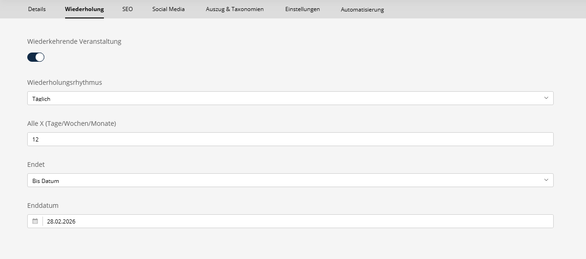

# Wiederkehrende Events

## Übersicht

Das Wiederholungs-Feature ermöglicht die Erstellung von Events, die sich nach einem regelmäßigen Zeitplan wiederholen. Das System generiert individuelle Event-Vorkommen basierend auf Wiederholungsregeln.

## Konfiguration

Wiederholungseinstellungen können für jedes Event im Tab **Wiederholung** des Event-Editors konfiguriert werden.

### Wiederholungsoptionen



#### Basiseinstellungen
- **Wiederholung aktivieren**: Wiederkehrenden Zeitplan für dieses Event aktivieren
- **Wiederholungsmuster**: Häufigkeit der Wiederholung
    - Täglich
    - Wöchentlich
    - Monatlich
    - Jährlich
- **Intervall**: Wiederholung alle X Tage/Wochen/Monate/Jahre (z.B. "2" für alle 2 Wochen)

#### Wöchentliche Wiederholung
Bei Auswahl von "Wöchentlich" können Sie festlegen:
- **Wochentage**: Bestimmte Wochentage auswählen, an denen das Event stattfinden soll

#### Endbedingungen
Wählen Sie, wann die Wiederholung enden soll:
- **Nie**: Event wiederholt sich unbegrenzt
- **Nach Anzahl**: Nach einer bestimmten Anzahl von Vorkommen beenden
- **Bis Datum**: An einem bestimmten Datum beenden

## Funktionsweise

Das Bundle verwendet zwei Ansätze für wiederkehrende Events:

1. **Virtuelle Vorkommen**: Vorkommen werden spontan beim Anzeigen von Kalendern generiert
2. **Physische Vorkommen**: Individuelle Event-Einträge werden per Kommando erstellt

### Virtuelle Vorkommen

Bei Event-Abfragen (z.B. für Kalenderdarstellung) generiert das System automatisch Vorkommen basierend auf Wiederholungsregeln innerhalb des angefragten Datumsbereichs.

### Physische Vorkommen

Für bessere Performance und Indizierung können Sie tatsächliche Event-Einträge mit dem bereitgestellten Konsolen-Kommando generieren.

## Konsolen-Kommando

Event-Vorkommen für den kommenden Zeitraum generieren:

```bash
php bin/console sulu:event:generate-recurring [--lookahead=TAGE]
```

### Parameter

- `--lookahead`: Anzahl der Tage im Voraus (Standard: 90)

### Beispiel

```bash
# Vorkommen für die nächsten 180 Tage generieren
php bin/console sulu:event:generate-recurring --lookahead=180
```

### Zeitplanung

Führe dieses Kommando regelmäßig per Cron aus:

```bash
# Täglich um 2:00 Uhr ausführen
0 2 * * * cd /pfad/zum/projekt && php bin/console sulu:event:generate-recurring
```

## Verwendung im Code

### RecurrenceGenerator Service

Der `RecurrenceGenerator`-Service verwaltet die Berechnung von Vorkommen:

```php
use Manuxi\SuluEventBundle\Service\RecurrenceGenerator;

public function __construct(
    private RecurrenceGenerator $recurrenceGenerator
) {}

public function generateOccurrences(EventRecurrence $recurrence)
{
    $start = new \DateTimeImmutable();
    $end = new \DateTimeImmutable('+90 days');
    
    $occurrences = $this->recurrenceGenerator->generateOccurrences(
        $recurrence,
        $start,
        $end
    );
    
    // $occurrences ist ein Array von DateTimeInterface-Objekten
    foreach ($occurrences as $date) {
        // Jedes Vorkommen-Datum verarbeiten
    }
}
```

### Wiederholung in Templates prüfen

```twig

    <div class="recurrence-info">
        <p>Dieses Event wiederholt sich {{ event.recurrence.frequency }}</p>
        
        
            <p>Bis: {{ event.recurrence.until|date('Y-m-d') }}</p>
        
            <p>{{ event.recurrence.count }} Vorkommen</p>
        
    </div>

```

## Wiederholungsregeln

### Täglich
Wiederholt sich alle X Tage.

**Beispiel**: Jeden Tag → `frequency: daily, interval: 1`

**Beispiel**: Alle 3 Tage → `frequency: daily, interval: 3`

### Wöchentlich
Wiederholt sich an bestimmten Wochentagen alle X Wochen.

**Beispiel**: Jeden Montag und Mittwoch → `frequency: weekly, interval: 1, byWeekday: [1, 3]`

**Beispiel**: Jeden zweiten Freitag → `frequency: weekly, interval: 2, byWeekday: [5]`

### Monatlich
Wiederholt sich am gleichen Tag des Monats alle X Monate.

**Beispiel**: Jeden Monat am 15. → `frequency: monthly, interval: 1`

**Beispiel**: Alle 3 Monate → `frequency: monthly, interval: 3`

### Jährlich
Wiederholt sich am gleichen Datum alle X Jahre.

**Beispiel**: Jährliches Event → `frequency: yearly, interval: 1`