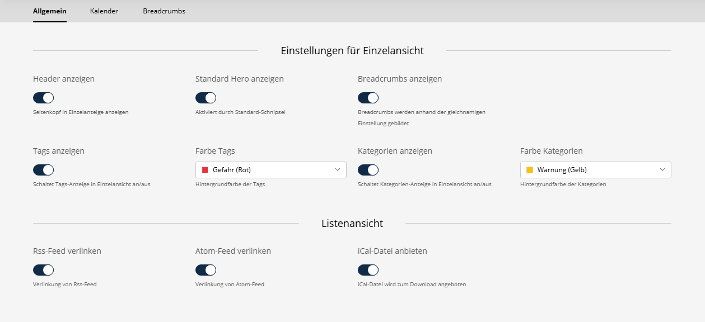
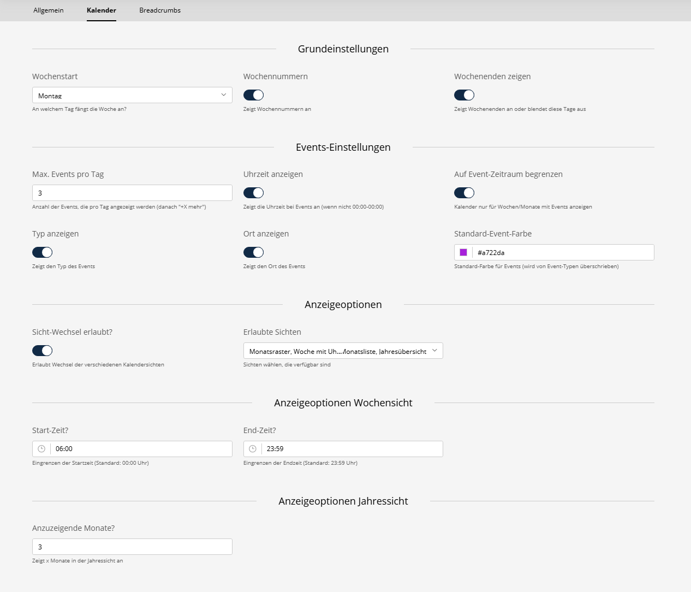
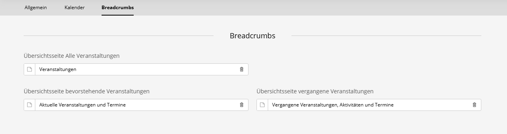

### Event Settings

Access via Sulu Admin → Events → Settings

### General

**Detail View:**
- Toggle Header, Hero-Image, Breadcrumbs
- Show Tags / Categories

**List View**
- Enable linking for
  - Rss-/Atom-Feeds
  - iCal-Download

### Calendar

**Basic Settings:**
- First day of the week
- Show week numbers
- Show weekends

**Events Settings**
- Max. events per day
- Show event time
- Limit to event time period
- Show event type
- Show event location
- Default event color

**Display Options**
- Allow visitors to change the view
- Allowed views

**Display Options Week View**
- Start time (Default: 00:00)
- End time (Default: 23:59)

**Display Options Year View**
- Months to display (Default: 3)

### Breadcrumbs

**Breadcrumbs:**
- Here you can define pages that appear as intermediate pages in the breadcrumbs when the corresponding filter is set.
- E.g. /events/[Page with all events]/SingleEvent